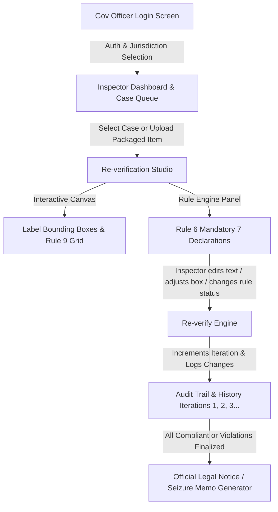

# Legal Metrology Inspector Portal & Multi-Cycle Re-verification Studio

## Overview
Develop a specialized, high-fidelity **Legal Metrology Inspector Portal** for the **Department of Consumer Affairs (DoCA), Ministry of Consumer Affairs, Food & Public Distribution, Government of India**. 

The solution addresses the exact requirements:
1. **Government Officer / Inspector Login**: Secure, official-style authentication with Role, Jurisdiction, Officer ID, and a 1-Click Demo Inspector Login for instant testing.
2. **Inspector Portal & Case Queue**: Work queue with pre-loaded real-world packaged commodity inspection cases (FMCG, Cosmetics, Staples) and new package upload/scan support.
3. **Multi-Cycle Re-verification Studio**: 
   - Interactive label viewer with editable OCR bounding boxes (Rule 6 declarations).
   - Live Rule 6 & Rule 9 (Font Height & Placement) compliance checks.
   - Capability for the inspector to adjust bounding boxes, edit extracted text, modify measurements, add inspector notes, and **trigger "Re-verify Compliance" multiple times**.
   - Complete **Re-verification Iteration History & Audit Trail** (tracking each verification round with before/after diffs).
4. **Legal Enforcement Output**: Instant generation of official **Show Cause Notices / Seizure Memos** under Section 36 of the Legal Metrology Act, 2009 and PCR 2011 with printable/PDF export.

---

## User Review Required
> [!IMPORTANT]
> - **Design Aesthetic ("Simple & Human-Crafted")**: As requested, the background and visual theme will avoid loud, synthetic, dark neon or cyber/AI gimmicks. Instead, it will feature an authentic, calm, human-crafted official desk aesthetic: clean warm paper/slate tones (`#F8F9FA` / `#F4F6F9`), subtle tactile borders (`#E2E8F0`), crisp typography, dignified Indian Government color accents (Deep Navy `#0A2540`, Warm Khadi Amber `#C27803`, Forest Emerald `#15803D`, Brick Red `#B91C1C`), and a focus on clarity, readability, and functional precision.
> - **Technology Choice**: We will build the application using **Vite + React** with **pure Vanilla CSS** (no TailwindCSS, custom design tokens).
> - **Pre-loaded Sample Cases**: The portal will include pre-loaded packaged commodity cases with different compliance statuses (Missing USP, Rule 9 font height violation, Missing Country of Origin, and Fully Compliant) so you can immediately test the multi-cycle re-verification process.
> - **1-Click Demo Inspector Login**: In addition to standard manual login credentials, a quick demo button (`Sh. Rajesh Sharma, Senior Legal Metrology Inspector, Delhi Central`) will allow testing without manual credential entry.

---

## Proposed Architecture & Key Features

---

## Proposed Changes

### Project Setup
- Initialize modern Vite + React web application in `d:/SIH_Rebuild`.
- Install lightweight icon library (`lucide-react`) and canvas/report utilities.
- Configure vanilla CSS tokens for the Government Design System (`#0A2540` Navy, `#D97706` Gold/Amber, `#16A34A` Success, `#DC2626` Danger, `#F8FAFC` Clean Slate).

### Component Breakdown

#### 1. Official Header & Navigation
- **`src/components/Header.jsx`**:
  - Ashoka Emblem & Government of India / Department of Consumer Affairs branding.
  - Officer Identity Badge (Name, ID: `LMO-DL-2024-8842`, Zone: `Central Delhi`).
  - Accessibility tools (Font resize A-/A+, High-Contrast toggle).
  - Quick Logout & Jurisdiction switcher.

#### 2. Inspector Authentication
- **`src/components/Login.jsx`**:
  - Official DoCA Inspector Login Portal styling.
  - Form fields: Officer Service ID / Gov Email (`@gov.in` / `@nic.in`), Password, Jurisdiction Zone, Captcha verification.
  - Quick Action: **"Instant Demo Login as Senior Inspector"**.
  - Informative legal notice regarding official access under Legal Metrology Act, 2009.

#### 3. Inspector Case Queue & Dashboard
- **`src/components/Dashboard.jsx`**:
  - Top Metrics: Total Inspections, Pending Re-verification, Flagged Violations, Resolved Cases.
  - Case Filter Tabs: `All Cases`, `Pending Re-verification`, `Seizure Recommended`, `Verified Compliant`.
  - Realistic packaged product cases (images, brand, net quantity, store/location, current iteration count).
  - "New Product Inspection" upload zone (supports drag & drop or camera capture simulation).

#### 4. The Core Feature: Multi-Cycle Re-verification Studio
- **`src/components/ReverificationStudio.jsx`**:
  - **Left Panel (Interactive Visual Label Inspector)**:
    - High-resolution package label display with pan/zoom.
    - Overlay of color-coded bounding boxes for Rule 6 declarations:
      - 🟢 Green: Compliant
      - 🔴 Red: Violation / Non-compliant format
      - 🟡 Yellow: Warning / Font size alert
    - Bounding box selection, drag & resize, and "+ Add New Bounding Box" tool.
    - Rule 9 Measurement tool: visual mm scale overlay against package surface area.
  - **Right Panel (Rule-by-Rule Inspector Workbench)**:
    - **Rule 6(1) Mandatory Checklist**:
      1. Name & Address of Manufacturer / Packer / Importer.
      2. Generic Name of Commodity.
      3. Net Quantity & Legal Metric Unit check.
      4. Month & Year of Manufacture / Packing / Import.
      5. MRP & Unit Sale Price (USP) validation (Rule 6(1)(e)).
      6. Consumer Care details (Name, Address, Phone, Email).
      7. Country of Origin & Importer disclosures.
    - **Editable OCR Fields**: Inspector can correct OCR text, update values, and verify font heights in millimeters.
    - **Inspector Findings & Notes**: Editable notes for each declaration.
  - **Re-verification Action & History Iterations**:
    - Prominent Button: **"Re-verify Compliance (पुनः सत्यापन करें)"**.
    - When clicked:
      - Re-evaluates all Rule 6 and Rule 9 checks based on latest inspector edits.
      - Calculates new Compliance Score.
      - Records a new snapshot in the **Iteration History** (`Iteration 1 (AI Automated)` -> `Iteration 2 (Inspector Adjusted Bounding Box & OCR)` -> `Iteration 3 (Final Re-check)`).
      - Displays iteration timeline so inspector can compare differences across rounds.

#### 5. Legal Notice & Inspection Memo Generator
- **`src/components/LegalNoticeModal.jsx`**:
  - Generates authentic **Show Cause Notice under Section 36 of Legal Metrology Act, 2009 & Rule 6/9 of PCR 2011**.
  - Formatted with official Ministry header, case reference number, officer signature, date, QR code, and attached photo evidence.
  - One-click Printable / PDF export.

---

## Verification Plan

### Automated / Build Verification
- Run `npm run build` to ensure zero compilation errors, clean bundle, and strict typing/lint hygiene.

### Interactive User Verification
- Test Officer Login and 1-Click Demo Login.
- Open sample case with violations (e.g. missing USP and font size discrepancy).
- Perform first Re-verification round: modify extracted OCR text, adjust a bounding box.
- Trigger "Re-verify Compliance" and observe iteration version bump to `v2` with updated compliance score.
- Perform a second Re-verification round: mark all declarations verified, trigger "Re-verify", observe version bump to `v3` and "Compliant" state.
- Generate and preview official Legal Notice / Seizure Memo modal.
